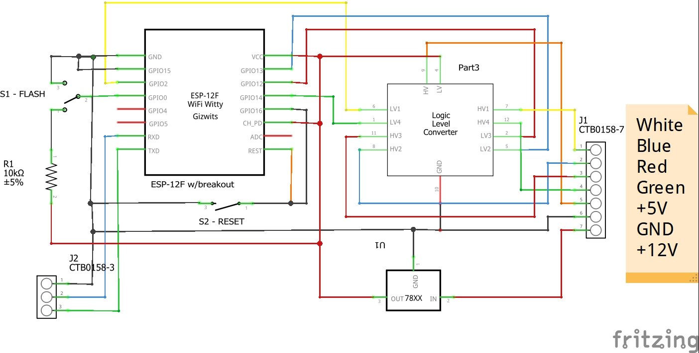
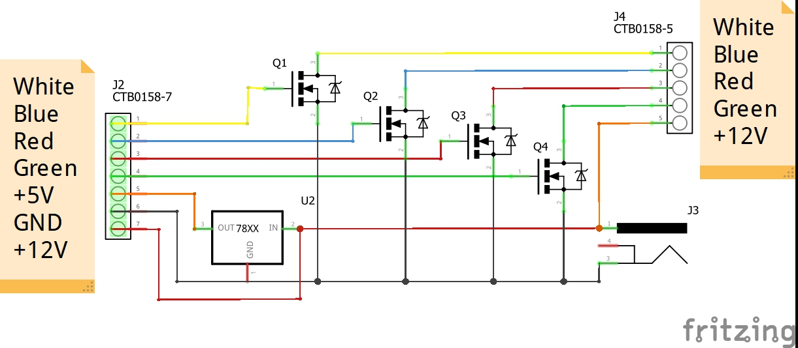

# RGBW LED Strip Control

Control a RGBW LED strip using MQTT protocol.

## Features

* MQTT enable: Subscribes to topic defined in config.h to set status, colors, brightness, and effects. The controller also reports the status back by publishing the topic defined in config.h

* OTA: Over the air update is enabled by default.

* Peristent Setting Storage. Status, colors, and brightness are save persistently in EEPROM. Falshing effects are not saved.

## Schemmatic

### Control Board

### Power Board

Notice J1 of the control board must be connected one-to-one with J2 of the power board.
A 12V external power source is required. Amperage depends on the LED strip.

## MQTT

There are only two topics defined in config.h:

CONFIG_MQTT_TOPIC_SET is the topic the controller subscribes to in order to received commands to set the RGBW LED strip.

CONFIG_MQTT_TOPIC_STATE is the topic the controller publishes to report the current status of the RGBW LED strip. (This is still WIP)

The payload is in JSON format and it is the same for both topics. All fields are optional.

    {
        "state": "ON" // or "OFF"
        "color": {
            "r": 255 // Red Color 0-255
            "g": 255 // Green Color 0-255
            "b": 255 // Blue Color 0-255
        }
        "brightness": 255 // 0-255
        "white_value": 255 // White Color for RGBW LEDs 0-255
        "effect": "colorful" // Light effect colorful|colorfade_slow|colorfade_fast|flash|christmas|pure_white
        "flashes": 10 // Flashes count
    }

Colorfade effects are not implemented yet.

## Notes

In order to build this software add a file named secret.h at ./include and define the following constant strings:

const char *SECRET_MQTT_USER = "mqtt-user-name";

const char *SECRET_MQTT_PASS = "mqtt-user-password";

const char *SECRET_MQTT_CLIENT_ID = "this-control-mqtt-client-id";

Your MQTT brokers address shall be configured on config.h.
